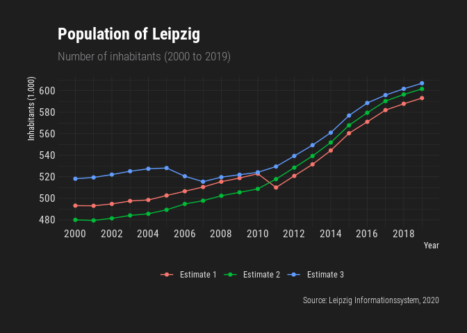

<!-- README.md is generated from README.Rmd. Please edit that file -->

# lisr

<!-- badges: start -->

<!-- badges: end -->

R interface to the `Leipzig Informationssystem`
([LIS](https://statistik.leipzig.de/statserv/servod.aspx)).

## Installation

``` r
remotes::install_github('nrkoehler/lisr')
```

## Usage

### Population

``` r
library(lisr)
library(tidyverse)
#> ── Attaching packages ────────────────────────────────────────────────────── tidyverse 1.3.0 ──
#> ✓ ggplot2 3.3.2     ✓ purrr   0.3.4
#> ✓ tibble  3.0.4     ✓ dplyr   1.0.2
#> ✓ tidyr   1.1.2     ✓ stringr 1.4.0
#> ✓ readr   1.4.0     ✓ forcats 0.5.0
#> ── Conflicts ───────────────────────────────────────────────────────── tidyverse_conflicts() ──
#> x dplyr::filter() masks stats::filter()
#> x dplyr::lag()    masks stats::lag()

df.POP <- get_lis_pop(rubrik_nr = 1) # inhabitants
```

``` r
glimpse(df.POP)
#> Rows: 27
#> Columns: 22
#> $ KENNZIFFER <chr> "Bevölkerung insgesamt", "Männer", "Frauen", "Deutsche", "…
#> $ EINHEIT    <lgl> NA, NA, NA, NA, NA, NA, NA, NA, NA, NA, NA, NA, NA, NA, NA…
#> $ JAHR_2000  <int> 493208, 237986, 255222, 466069, 219912, 246157, 27139, 180…
#> $ JAHR_2001  <int> 493052, 238175, 254877, 463959, 219207, 244752, 29093, 189…
#> $ JAHR_2002  <int> 494795, 239154, 255641, 463717, 219377, 244340, 31078, 197…
#> $ JAHR_2003  <int> 497531, 240878, 256653, 465230, 220637, 244593, 32301, 202…
#> $ JAHR_2004  <int> 498491, 240818, 257673, 467644, 222198, 245446, 30847, 186…
#> $ JAHR_2005  <int> 502651, 243125, 259526, 470903, 224174, 246729, 31748, 189…
#> $ JAHR_2006  <int> 506578, 245017, 261561, 474597, 226368, 248229, 31981, 186…
#> $ JAHR_2007  <int> 510512, 247282, 263230, 477724, 228329, 249395, 32788, 189…
#> $ JAHR_2008  <int> 515469, 250018, 265451, 481941, 230729, 251212, 33528, 192…
#> $ JAHR_2009  <int> 518862, 251748, 267114, 486564, 233397, 253167, 32298, 183…
#> $ JAHR_2010  <int> 522883, 253533, 269350, 492686, 236809, 255877, 30197, 167…
#> $ JAHR_2011  <int> 510043, 245137, 264906, 487244, 232954, 254290, 22799, 121…
#> $ JAHR_2012  <int> 520838, 251491, 269347, 495062, 237401, 257661, 25776, 140…
#> $ JAHR_2013  <int> 531562, 257445, 274117, 502719, 241647, 261072, 28843, 157…
#> $ JAHR_2014  <int> 544479, 264914, 279565, 511069, 246416, 264653, 33410, 184…
#> $ JAHR_2015  <int> 560472, 274414, 286058, 518473, 250522, 267951, 41999, 238…
#> $ JAHR_2016  <int> 571088, 280292, 290796, 523565, 253236, 270329, 47523, 270…
#> $ JAHR_2017  <int> 581980, 285777, 296203, 529804, 256245, 273559, 52176, 295…
#> $ JAHR_2018  <int> 587857, 288553, 299304, 533218, 257964, 275254, 54639, 305…
#> $ JAHR_2019  <int> 593145, 291450, 301695, 535813, 259368, 276445, 57332, 320…
df.POP$KENNZIFFER
#>  [1] "Bevölkerung insgesamt"  "Männer"                 "Frauen"                
#>  [4] "Deutsche"               "Männer"                 "Frauen"                
#>  [7] "Ausländer"              "Männer"                 "Frauen"                
#> [10] "Bevölkerung insgesamt"  "Männer"                 "Frauen"                
#> [13] "Deutsche"               "Männer"                 "Frauen"                
#> [16] "Ausländer"              "Männer"                 "Frauen"                
#> [19] "Bevölkerung insgesamt"  "Männer (Melderegister)" "Frauen (Melderegister)"
#> [22] "Deutsche"               "Männer"                 "Frauen"                
#> [25] "Ausländer"              "Männer"                 "Frauen"
```

``` r
df.POP_sub <- df.POP %>% 
  filter(KENNZIFFER == 'Bevölkerung insgesamt') %>% 
  select(-EINHEIT) %>% 
  mutate(KENNZIFFER = c('Estimate 1', 'Estimate 2', 'Estimate 3'))
  
```

``` r
df.POP_sub <- df.POP_sub %>% 
  pivot_longer(cols = starts_with('JAHR'),
               names_to = 'Year',
               values_to = 'Inhabitants') %>% 
  mutate(Year = as.numeric(str_remove(Year, 'JAHR_')))
```

``` r
ggplot(df.POP_sub, aes(x = Year, 
                       y = Inhabitants/1000)) +
  geom_line(aes(colour = KENNZIFFER)) +
  scale_x_continuous(breaks = seq(2000, 2019, 2)) +
  scale_y_continuous(breaks = seq(480, 650, 10)) +
  theme_light() +
  theme(legend.position = 'bottom') +
  labs(colour = NULL,
       y = 'Inhabitants (1.000)',
       title = 'Population of Leipzig',
       subtitle = 'Number of inhabitants (2000 to 2019)',
       caption = 'Source: Leipzig Informationssystem, 2020')
```



### Housing

``` r
df.HOUSING <- get_lis_housing(rubrik_nr = 3) # flat rents
```

``` r
glimpse(df.HOUSING)
#> Rows: 10
#> Columns: 20
#> $ KENNZIFFER <chr> "Haushalte insgesamt", "1-Personen-Haushalte", "2-Personen…
#> $ EINHEIT    <chr> "Median in Euro pro m²", "Median in Euro pro m²", "Median …
#> $ JAHR_2000  <dbl> 4.76, 4.72, 4.79, 4.88, 4.58, 6.39, 6.33, 6.44, 6.39, 6.29
#> $ JAHR_2001  <dbl> 4.73, 4.81, 4.66, 4.81, 4.30, 6.39, 6.39, 6.48, 6.57, 6.08
#> $ JAHR_2003  <dbl> 4.82, 4.83, 4.91, 4.72, 4.65, 6.53, 6.53, 6.58, 6.55, 6.28
#> $ JAHR_2005  <dbl> 4.67, 4.69, 4.81, 4.40, 4.51, 6.53, 6.51, 6.65, 6.43, 6.46
#> $ JAHR_2006  <dbl> 4.86, 4.87, 4.84, 4.98, 4.76, 6.76, 6.78, 6.78, 6.75, 6.50
#> $ JAHR_2007  <dbl> 4.83, 4.80, 5.00, 4.99, 4.67, 6.90, 6.91, 6.94, 6.93, 6.74
#> $ JAHR_2008  <dbl> 4.98, 5.00, 4.93, 4.98, 4.67, 6.92, 6.93, 6.89, 6.94, 6.67
#> $ JAHR_2009  <dbl> 4.98, 5.00, 4.86, 4.82, 5.00, 6.95, 6.92, 7.03, 6.77, 6.70
#> $ JAHR_2010  <dbl> 5.12, 5.19, 5.00, 4.79, 5.05, 7.12, 7.15, 7.13, 7.05, 6.95
#> $ JAHR_2011  <dbl> 5.00, 4.97, 5.00, 5.00, 4.87, 7.08, 7.10, 7.08, 7.03, 6.85
#> $ JAHR_2012  <dbl> 5.145161, 5.145161, 5.172414, 5.000000, 4.687500, 7.200000…
#> $ JAHR_2013  <dbl> 5.075000, 5.034483, 5.147059, 5.072464, 5.150000, 7.228916…
#> $ JAHR_2014  <dbl> 5.384615, 5.454241, 5.238831, 5.313516, 5.344841, 7.446808…
#> $ JAHR_2015  <dbl> 5.294117, 5.244824, 5.333333, 5.488810, 5.326422, 7.500000…
#> $ JAHR_2016  <dbl> 5.390000, 5.333333, 5.407605, 5.600999, 5.399330, 7.590000…
#> $ JAHR_2017  <dbl> 5.620000, 5.563269, 5.622829, 5.631813, 5.891208, 7.770000…
#> $ JAHR_2018  <dbl> 5.875000, 5.833333, 5.938923, 5.961625, 6.187846, 8.208551…
#> $ JAHR_2019  <dbl> 6.029364, 6.000000, 6.034483, 6.641187, 6.260099, 8.181818…
df.HOUSING$KENNZIFFER
#>  [1] "Haushalte insgesamt"            "1-Personen-Haushalte"          
#>  [3] "2-Personen-Haushalte"           "3-Personen-Haushalte"          
#>  [5] "4- und Mehr-Personen-Haushalte" "Haushalte insgesamt"           
#>  [7] "1-Personen-Haushalte"           "2-Personen-Haushalte"          
#>  [9] "3-Personen-Haushalte"           "4- und Mehr-Personen-Haushalte"
```

``` r
df.HOUSING_sub <- df.HOUSING %>% 
  filter(KENNZIFFER == 'Haushalte insgesamt') %>% 
  mutate(KENNZIFFER = c('Estimate 1', 'Estimate 2'))
  
```

``` r
df.HOUSING_sub <- df.HOUSING_sub %>% 
  pivot_longer(cols = starts_with('JAHR'),
               names_to = 'Year',
               values_to = 'Rent') %>% 
  mutate(Year = as.numeric(str_remove(Year, 'JAHR_')))
```

``` r
ggplot(df.HOUSING_sub, aes(x = Year, 
                       y = Rent)) +
  geom_line(aes(colour = KENNZIFFER)) +
  scale_x_continuous(breaks = seq(2000, 2019, 2)) +
   scale_y_continuous(breaks = seq(4, 9, 1)) +
  theme_light() +
  theme(legend.position = 'bottom') +
  labs(colour = NULL,
       y = '€/m²',
       title = 'Median rent in €/m²',
       subtitle = '2000 to 2019',
       caption = 'Source: Leipzig Informationssystem, 2020')
```


